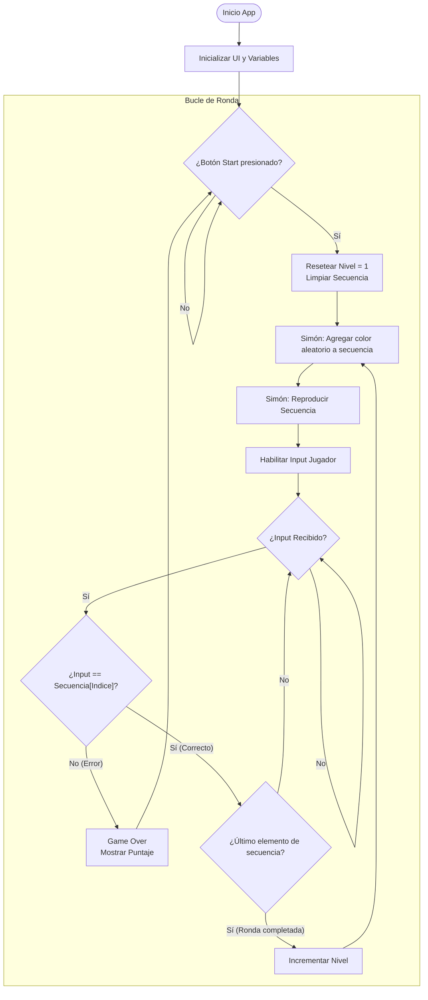
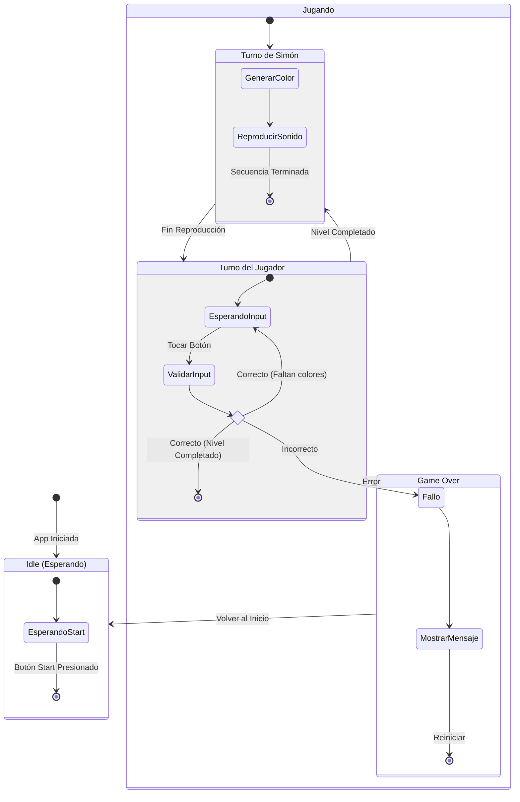

1. Diagrama de Flujo 

```mermaid
flowchart TD
    A([Inicio App]) --> B[Inicializar UI y Variables]
    B --> C{"¿Botón Start presionado?"}
    C -- No --> C
    C -- Sí --> D[Resetear Nivel = 1\nLimpiar Secuencia]
    
    subgraph Ronda [Bucle de Ronda]
        D --> E[Simón: Agregar color aleatorio a secuencia]
        E --> F[Simón: Reproducir Secuencia]
        F --> G[Habilitar Input Jugador]
        
        G --> H{"¿Input Recibido?"}
        H -- No --> H
        H -- Sí --> I{"¿Input == Secuencia[Indice]?"}
        
        I -- No (Error) --> J[Game Over\nMostrar Puntaje]
        J --> C
        
        I -- Sí (Correcto) --> K{"¿Último elemento de secuencia?"}
        K -- No --> H
        K -- Sí (Ronda completada) --> L[Incrementar Nivel]
        L --> E
    end
```
2. Diagrama de Estados 

Representa los estados en los que puede estar el sistema y las transiciones permitidas.

```mermaid
stateDiagram-v2
    [*] --> Idle : App Iniciada

    state "Idle (Esperando)" as Idle {
        [*] --> EsperandoStart
        EsperandoStart --> [*] : Botón Start Presionado
    }

    state "Jugando" as Jugando {
        [*] --> TurnoSimon
        
        state "Turno de Simón" as TurnoSimon {
            GenerarColor --> ReproducirSonido
            ReproducirSonido --> [*] : Secuencia Terminada
        }
        
        TurnoSimon --> TurnoJugador : Fin Reproducción
        
        state "Turno del Jugador" as TurnoJugador {
            [*] --> EsperandoInput
            EsperandoInput --> ValidarInput : Tocar Botón
            
            state ValidarInput_Decision <<choice>>
            ValidarInput --> ValidarInput_Decision
            
            ValidarInput_Decision --> EsperandoInput : Correcto (Faltan colores)
            ValidarInput_Decision --> [*] : Correcto (Nivel Completado)
            ValidarInput_Decision --> Fallo : Incorrecto
        }
        
        TurnoJugador --> TurnoSimon : Nivel Completado
        TurnoJugador --> GameOver : Error
    }
    state "Game Over" as GameOver {
        Fallo --> MostrarMensaje
        MostrarMensaje --> [*] : Reiniciar
    }

    GameOver --> Idle : Volver al Inicio
```
